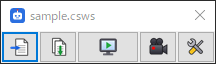
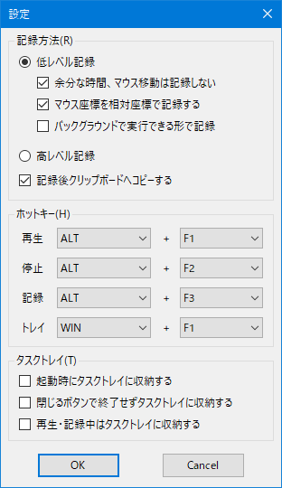

#  CsWSC — C# Window Script

UWSC のように Windows 操作を自動化する RPA ツール。  
スクリプトは **C#** で書きます。   (.NET 10 / Roslyn Scripting)。

## 使い方

画面は UWSC と同じツールバー型です。



```
[読込み] [保存] [再生] [記録] [設定]
```

- **読込み / 保存**: スクリプト (`.csws`) の読込み・別名保存。前回のスクリプトは起動時に復元
- **再生**: 再生中は停止ボタンになる
- **記録**: 押すと記録開始 (ボタンが停止マークに)。もう一度押すか記録/停止ホットキーで終了。記録内容は保存前でも再生・編集できる
- **設定**: 設定ダイアログ / スクリプト編集・新規作成 / 常に手前 / PRINT 窓 / API 一覧 / 終了
- `Print()` の出力は PRINT 窓に表示。エラーはダイアログで表示し、エディタで該当行を選択
- `CsWSC.exe script.csws` で読み込み即再生

### 設定ダイアログ



- **記録方法**: 低レベル記録 (余分な時間・マウス移動を省く / 相対座標 / バックグラウンド実行形式) / 高レベル記録 / 記録後クリップボードへコピー 
- **ホットキー** (グローバル): 再生 `ALT+F1` / 停止 `ALT+F2` / 記録 `ALT+F3` / トレイ格納 `WIN+F1` (既定値)
- **Pause キー**は常に停止として使える (非常停止用)
- 設定は `%AppData%\CsWSC\settings.json` に保存

## VS Code で編集する

VS Code 拡張 [CsWSC](https://marketplace.visualstudio.com/items?itemName=kttFox.csws) を入れると、`.csws` ファイルを VS Code で快適に編集・実行できます。

- **補完**: 組み込みコマンド (`Click` `GetWindow` …)、`Window` のメンバー、.NET の型・メソッド
- **ホバー / 補完の説明**: シグネチャと説明文 (CsWSC のコマンドは日本語、.NET は英語)
- **引数ヒント**: `(` や `,` を入力すると引数の一覧と、入力中の引数を表示
- **エラー表示**: 入力が止まってから 0.5 秒後に、コンパイルエラーと警告に波線を表示
- **実行**: `F5` またはエディター右上の ▶ で、保存してから CsWSC.exe で実行

### インストール

VS Code の拡張機能ビュー (`Ctrl+Shift+X`) で「CsWSC」を検索してインストールするか、次のコマンドを実行します。

```
code --install-extension kttFox.csws
```

初回実行時に CsWSC.exe の場所を聞かれます (設定 `csws.exePath` に保存)。

詳しくは [editors/vscode/README.md](editors/vscode/README.md) を参照してください。

## スクリプト例

```csharp
var notepad = Exec("notepad.exe") ?? GetWindow("メモ帳", timeout: 5);
if (notepad == null) { Print("見つかりません"); return; }

notepad.Activate().Move(100, 100, 600, 400);
for (var i = 1; i <= 3; i++)
{
    notepad.SendText($"{i} 行目");
    Kbd(Keys.Enter);
    Sleep(0.2);
}
notepad.SendKeys(Keys.ControlKey, Keys.S);
```

C# の構文・LINQ・`System.IO` などはそのまま使えます。
既定で `System`, `System.IO`, `System.Linq`, `System.Text`, `System.Collections.Generic`,
`System.Threading`, `System.Drawing`, `System.Windows.Forms`, `CsWSC` を using 済みです。

## 組み込み API

詳しい使い方・引数・戻り値・UWSC との対応は [コマンド説明書 (docs/Commands.md)](docs/Commands.md) を参照してください。

## 記録

設定の「記録方法」に従って C# スクリプトを生成します。

| 記録方法 | 生成されるコード例 |
|---|---|
| 低レベル (絶対座標) | `Click(300, 250);` `SendText("abc");` `Hotkey(Keys.ControlKey, Keys.S);` |
| 低レベル + 相対座標 | `var w1 = GetWindow("無題 - メモ帳", "Notepad", 5) ?? throw ...;` `w1.Click(200, 150);` |
| 低レベル + バックグラウンド | `w1.PostClick(200, 150);` `w1.PostText("abc");` (前面に出さずメッセージ送信) |
| 高レベル | `w2.ClickItem("保存(S)");` (UI Automation でコントロール名から操作) |

- 「余分な時間、マウス移動は記録しない」: ボタンを押していないマウス移動を省き、待ち時間を最大 0.5 秒に短縮
- 英数字・スペースの連続入力は `SendText` にまとめる。修飾キーとの組み合わせは `Hotkey`
- CsWSC 自身の窓への操作と、記録終了に使ったホットキーは記録しない
- 制限: IME (日本語入力) の変換操作は文字列としては記録されない。バックグラウンド記録でもショートカットキー (`Hotkey`) は前面のウィンドウに送られる

## 停止について

組み込み API (`Sleep`, `Kbd`, `Click` など) の呼び出し時に停止要求を確認します。  
API を呼ばない無限ループは停止できないため、その場合はループ内で `Cancellation.ThrowIfCancellationRequested()` を呼んでください。
